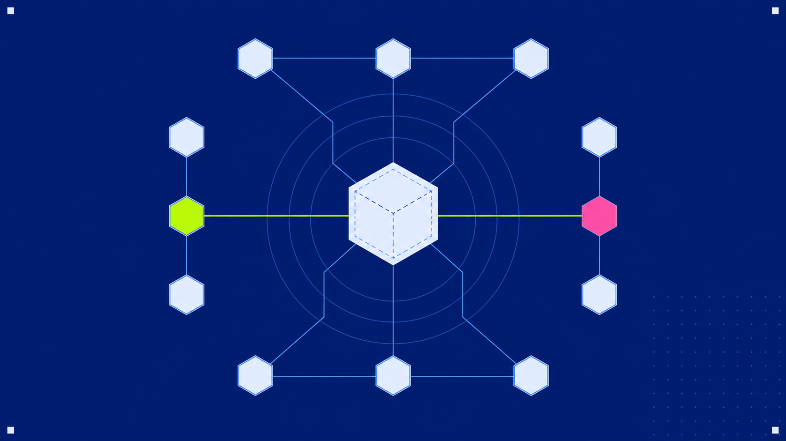

# Seam

<p align="center">
  
</p>

**Local code intelligence for AI agents.** Index a codebase once; agents query its structure instead of re-discovering it with `grep` every session.

`v0.3.0` · 12 languages · 16 MCP tools · SQLite-backed · **zero network calls at query time** · gate-green (~3,055 tests)

[](https://github.com/Catafal/seam/actions/workflows/ci.yml)

---

## The problem

An AI coding agent starts every session blind. To answer "what breaks if I change `init_db`?" it greps for the name, opens each hit, reads the surrounding code, follows the imports, and reconstructs the call graph by hand — spending thousands of tokens rebuilding structural knowledge that was true last session and the session before.

That structure is *computable*. A parser already knows that `index_one_file` calls `init_db`, that `Server` holds a `Client`, that `UserView` implements `Renderable`. Seam computes it once, stores it in a local SQLite graph, and exposes it over a handful of MCP tools so the agent **asks instead of greps**.

```text
Without Seam:  "what calls init_db?"  → grep → 14 files → read each → trace imports → ~30k tokens, often wrong
With Seam:     seam_impact init_db    → blast radius by risk tier → ~4.5k tokens, graph-accurate
```

<p align="center">
  
</p>

The win compounds: every structural question — callers, blast radius, call paths, functional areas, which tests to run — is one tool call against a graph that stays fresh automatically.

## The mental model

Think of Seam as **a compiler's symbol table and call graph for your whole repository**, kept fresh in the background and exposed over MCP and a CLI.

```text
  source files                tree-sitter            .seam/seam.db
  (12 languages)   ─────────▶  structural    ─────▶  SQLite + FTS5        ◀── file watcher
                               parsing               (symbols + edges          (debounced
                                                       + clusters + FTS)         re-index)
                                                            │
                                            ┌───────────────┴───────────────┐
                                            ▼                               ▼
                                     MCP server (stdio)              CLI read commands
                                     16 read-only tools              schema / query / impact …
                                            │                               │
                                            └──────────────┬────────────────┘
                                                           ▼
                                            AI agent (Claude Code · Cursor · Codex)
```

Three properties define it:

- **Indexed once, fresh forever.** `seam init` builds the graph; an optional `watchdog` daemon re-indexes edited files in the background. The agent never thinks about staleness — and graph-traversal tools surface a banner if the index *is* stale.
- **100% local.** The index is a per-project SQLite file (`.seam/seam.db`). The read path makes **no network calls** — no API keys, no cloud, no telemetry.
- **A graph, not a search box.** Symbols are nodes; calls, imports, inheritance, composition, and field access are typed edges. Every answer is graph traversal, not string matching.

---

## Quickstart

Published on PyPI as **`seam-code`** — the PyPI name `seam` belongs to an unrelated package, so the *distribution* is `seam-code` while the import package and the `seam` command keep the short name.

```bash
pip install seam-code              # CLI only
pip install 'seam-code[server]'    # + the MCP server (seam start)
pip install 'seam-code[semantic]'  # + semantic search (fastembed, ONNX/CPU, ~67 MB model on first run)
pip install 'seam-code[web]'       # + the Seam Explorer web UI (FastAPI)
```

Or from source with uv:

```bash
git clone <repo-url> && cd seam
uv sync                     # CLI only — no MCP server, no semantic search
uv sync --extra server      # + the MCP server (`seam start`) — adds the `mcp` package
uv sync --extra semantic    # + semantic search (fastembed, ONNX/CPU, no torch, ~67 MB model on first run)
uv sync --extra web         # + the Seam Explorer web UI (FastAPI)
# everything: uv sync --extra server --extra semantic --extra web
```

### Use it from the CLI (no server needed)

Every read command queries the SQLite index directly — the full feature set works with no MCP server running:

```bash
cd /path/to/your/project
uv run seam init                       # index the project (writes .seam/seam.db)
uv run seam search "auth token"        # full-text (hybrid semantic when enabled)
uv run seam query "verify user login"  # concept search + 1-hop graph expansion
uv run seam graph-search --preset hotspot --json  # structural graph search
uv run seam architecture --json        # bounded repo architecture briefing
uv run seam context authenticate_user  # 360° view: callers, callees, cluster, signature
uv run seam impact  authenticate_user  # blast radius by risk tier
uv run seam structure                  # whole-repo directory/container map
# also: trace · changes · why · clusters · affected · flows · pack · status · sync
```

### Wire it to an AI agent

`seam install` defaults to writing a **token-lean CLI playbook** into the repo so the agent queries via the `seam` CLI (cheaper than MCP — the CLI's `--quiet` mode is ~14× leaner than the leanest MCP call, and there's no ~6k-token standing tool-schema cost). It renders into each agent's cheapest native mechanism: a Claude Code skill, a Cursor agent-requested rule, and an `AGENTS.md` block for Codex.

```bash
uv run seam install                       # CLI guidance for Claude Code (skill + CLAUDE.md hook)
uv run seam install --target all          # guidance for Claude Code + Cursor + Codex
uv run seam install --with-mcp            # ALSO wire the MCP server (needs the `server` extra)
uv run seam install --print-config        # preview everything, write nothing
uv run seam uninstall                     # reverse it (removes guidance + MCP config)
```

The guidance teaches the agent the escalation ladder (`--quiet` → `--json --lean` → full `--json`), how to keep the index fresh (`seam init` / `seam sync`), and when to reach for each command. It's idempotent (a marker-delimited block in `AGENTS.md`/`CLAUDE.md`, never duplicated, foreign content preserved) and reversible.

Prefer native tool-calling? Add `--with-mcp` (install the `server` extra first). To wire MCP by hand, add to `.mcp.json` at the repo root:

```json
{
  "mcpServers": {
    "seam": { "type": "stdio", "command": "seam", "args": ["start", "/path/to/your/project"] }
  }
}
```

---

## The 16 MCP tools

Grouped by the question an agent is asking. Every tool is **read-only**; the server never writes the index.

### Find code

| Tool | Answers | Key args |
|------|---------|----------|
| `seam_schema` | "What can this index answer?" — schema version, counts, optional capabilities, freshness, tool guidance, and warnings. | `verbose` |
| `seam_architecture` | "What kind of repo is this?" — bounded architecture briefing with physical areas, clusters, entry points, hotspots, boundaries, edge mix, warnings, and next calls. | `scope`, `sections` (MCP) / `section` (CLI/Web), `limit`, `max_bytes` |
| `seam_search` | "Where is text X mentioned?" — FTS5 over names + docstrings + signatures, with fuzzy fallback; hybrid keyword+semantic when enabled. | `text`, `limit`, `semantic` |
| `seam_query` | "Find all code related to concept X." — FTS5 match + 1-hop graph expansion, rescored by name/path/cluster signals. | `concept`, `limit`, `semantic` |
| `seam_graph_search` | "Which symbols match this graph shape?" — typed structural discovery by kind, edge kind, degree, path, preset, and optional one-hop previews. | `kind`, `edge_kind`, `direction`, `preset`, `limit` |
| `seam_snippet` | "Show me the exact code for this result." — bounded source text by UID, symbol, symbol+file, or file+line, with freshness/truncation warnings and optional same-file neighbor hints. | `uid`, `symbol`, `file`, `line`, `include_neighbors` |

### Understand a symbol

| Tool | Answers | Key args |
|------|---------|----------|
| `seam_context` | "Show me everything about symbol X." — callers, callees, signature, cluster, `field_readers`/`field_writers`. Resolves bare/qualified/class names and merges homonyms. | `symbol` or `uid` |
| `seam_context_pack` | "Give me a paste-ready bundle for X." — `seam_context` + WHY comments + enriched neighbors + cluster peers in one call; neighbors ranked by relevance to the seed. | `symbol` |
| `seam_why` | "Why is this code like this?" — the `WHY`/`HACK`/`NOTE`/`TODO`/`FIXME` comments. | `symbol`, `path` |

### Assess change risk

| Tool | Answers | Key args |
|------|---------|----------|
| `seam_impact` | "What breaks if I change X?" — blast radius bucketed into risk tiers, with provenance, summary counts, and a hard byte/entry budget. | `target`, `direction`, `max_depth`, `limit`, `max_bytes` |
| `seam_changes` | "Is my current diff risky?" — git diff → changed symbols → overall risk level. | `scope`, `base_ref` |
| `seam_affected` | "Which tests should I run?" — changed files → impacted test files via reverse-dependency traversal. | `changed_files`, `depth` |

### Navigate the graph

| Tool | Answers | Key args |
|------|---------|----------|
| `seam_trace` | "How does X reach Y?" — shortest call/dependency path, hop by hop, with edge kind + confidence. | `source`, `target`, `max_depth` |
| `seam_flows` | "Where does execution start, and where does it go?" — entry points ranked by reach, or one entry's forward call-chain tree. | `entry` (optional) |

### Map the repository

| Tool | Answers | Key args |
|------|---------|----------|
| `seam_clusters` | "What are the functional areas?" — Louvain communities (semantic coupling), or the members of one. | `cluster_id` (optional) |
| `seam_structure` | "How is the repo laid out?" — the filesystem → directory → file → container tree with symbol counts and area labels. | `path`, `depth`, `nodes` |

> **Lean mode.** The enrichment-carrying tools (`seam_context`, `seam_trace`, `seam_impact`, `seam_context_pack`) accept `verbose=false` (CLI `--lean`) to drop heavy provenance fields and shrink the response for tight token budgets. `seam_impact` additionally supports a hard `max_bytes` ceiling and emits `next_actions` hints when results are trimmed.

---

## Supported languages

Twelve languages, parsed with [tree-sitter](https://tree-sitter.github.io/). All share the same tools, symbol kinds, edge kinds, and enrichment fields.

| Language | Extensions | | Language | Extensions |
|----------|-----------|-|----------|-----------|
| Python | `.py` | | C# | `.cs` |
| TypeScript | `.ts` `.tsx` | | Ruby | `.rb` |
| JavaScript | `.js` `.mjs` `.cjs` | | C | `.c` `.h` |
| Go | `.go` | | C++ | `.cpp` `.cc` `.cxx` `.c++` `.hpp` `.hh` `.hxx` |
| Rust | `.rs` | | PHP | `.php` |
| Java | `.java` | | Swift | `.swift` |

> **Kotlin is not yet supported** — the available tree-sitter-kotlin grammar mis-parses common constructs (interfaces, objects, classes with constructors). Tracked for a future release. See [`docs/adr/009-swift-support.md`](docs/adr/009-swift-support.md).
>
> Per-language extraction caveats (e.g. `.h` maps to C; C++ method visibility; Ruby dynamic visibility) are documented in [`docs/CONCEPTS.md`](docs/CONCEPTS.md#per-language-notes).

---

## Benchmarks

Two reproducible, deliberately-honest benchmarks back the pitch.

**Token reduction vs. `grep` + read** — [`docs/benchmark.md`](docs/benchmark.md)

> **91.8% fewer tokens** vs. realistic whole-file grep (88.7% vs. a conservative
> windowed grep), across 6 structural questions — 314k → 26k estimated tokens. Every
> query is a win; the largest are the things grep is worst at (`seam_clusters` 97.9%,
> `seam_search` 97%).

Reproduce: `seam init . && python benchmarks/run_benchmark.py`.

**Head-to-head vs. CodeGraph / graphify** — [`docs/competitive-benchmark.md`](docs/competitive-benchmark.md)

Run on an external repo Seam had never seen:

- **Fastest index — 0.26s** (others 0.60–4.04s) and **smallest footprint — 1.1 MB** (others 3.4–45 MB).
- **The only tool that writes nothing outside its own `.seam/` folder** — others mutate your `AGENTS.md`/`CLAUDE.md` or config on install.
- Leanest answer on concept search.

Both are static *retrieval-context* proxies (chars ÷ 4), not live agent-session A/Bs —
the docs state their own limitations. The competitive run predates the Phase 8 impact-tool
fix, so current output is leaner than it shows.

---

## Core concepts

A short tour — the full treatment is in [`docs/CONCEPTS.md`](docs/CONCEPTS.md).

**The graph.** Nodes are symbols (`function`, `class`, `method`, `interface`, `type`, `field`). Edges are **typed** and capture nine relationships:

| Edge kind | Captures |
|-----------|----------|
| `call` | one symbol invokes another |
| `import` | a module/symbol import |
| `extends` · `implements` | class inheritance / interface conformance |
| `instantiates` | `new Foo()` / struct-literal construction |
| `holds` | a class **stores** a typed field/property (composition / DI) |
| `uses` | a function **references** a user type as a parameter (signature coupling) |
| `reads` · `writes` | a field/property is read or written (data-flow) |

Edges are keyed by **symbol name**, not row id — this is what lets the watcher re-index one file independently without rewriting the whole graph. All traversal is kind-agnostic, so every tool picks up every edge kind automatically.

**Confidence tiers.** Each edge resolves to `EXTRACTED` (target is unambiguous), `AMBIGUOUS` (name collides — verify), or `INFERRED` (heuristic / cross-module). A multi-hop path is only as strong as its weakest hop. Each result carries `resolved_by` provenance explaining *how* the tier was decided.

**Risk tiers.** `seam_impact` and `seam_changes` bucket dependents by distance: `WILL_BREAK` (d=1, must update), `LIKELY_AFFECTED` (d=2, should test), `MAY_NEED_TESTING` (d≥3, test if critical). `seam_changes` rolls these up into `low` → `medium` → `high` → `critical`.

**Clusters.** A pure-Python Louvain pass groups symbols into functional areas by coupling. Labels are deterministic by default (`dir/file — top symbol`) or, opt-in, LLM-generated at index time only.

**Edge synthesis.** Static parsing can't see runtime polymorphism. A post-pass over the whole graph synthesizes the edges parsing structurally misses — interface→implementation fan-out, closure-collection dispatch, event-emitter handlers — tagged with their provenance channel.

**Semantic search.** Opt-in local embeddings (fastembed, ONNX on CPU) merge with FTS5 via Reciprocal Rank Fusion, so `"retry logic"` can surface `_backoff_with_jitter` even with no shared token. The model downloads once, then runs 100% locally.

**Staleness banner.** Graph-traversal tools attach an `index_status` banner when the index has drifted from disk — so an agent is never silently handed wrong blast-radius answers.

---

## Configuration

Everything is environment-variable driven with sensible defaults — see [`docs/CONFIGURATION.md`](docs/CONFIGURATION.md) for the full reference (~50 knobs). The few you might actually set:

| Variable | Default | Effect |
|----------|---------|--------|
| `SEAM_SEMANTIC` | `off` | Enable hybrid keyword + semantic search (needs the `semantic` extra + `seam init --semantic`). |
| `SEAM_CLUSTER_NAMING` | `deterministic` | `llm` opts into LLM cluster labels at index time (needs `SEAM_LLM_API_KEY`). Read path stays 100% local regardless. |
| `SEAM_IMPACT_MAX_BYTES` | `0` (off) | Hard character ceiling on `seam_impact` output for tight context budgets. |

Most knobs are gated `on` by default and have an `off` that restores byte-identical pre-feature behavior — a deliberate discipline so upgrades never silently change tool output.

---

## Seam Explorer — local visual graph UI

`seam serve` (the `[web]` extra) starts a read-only, `127.0.0.1`-only browser explorer for the index.

```bash
uv sync --extra web
seam init          # index first
seam serve         # opens http://127.0.0.1:7420
seam serve --no-open --port 8000
```

A React + TypeScript SPA (React Flow) served by FastAPI. Nothing leaves the machine. Features: command-palette search, a depth-1 caller/callee card-canvas with confidence-styled edges, lazy expand, a detail panel, an impact overlay that paints blast radius by risk tier, a trace-path highlighter, a git-changes drawer, a schema/architecture read API, and a whole-repo cluster constellation. Explorer routes reuse the **same handlers** that power the CLI/MCP tools — a third transport, no query logic duplicated.

---

## Architecture

The import hierarchy is strictly layered — read flows down, never up:

```text
cli / server / web  →  analysis  →  query  →  indexer / db
```

`analysis` is built from **pure leaf modules** (no DB, no IO, never raise) — clustering, RWR neighbor ranking, byte budgeting, the truncation steer, staleness detection. This makes each piece testable in isolation and keeps the failure surface tiny.

- **Read it as a narrative:** [`docs/ARCHITECTURE.md`](docs/ARCHITECTURE.md) — current system overview, then the full phase-by-phase history.
- **Read it as a diagram:** [`docs/architecture.html`](docs/architecture.html) — a standalone illustrated page (system pipeline, layered hierarchy, data-flow, edge-kind graph, schema).
- **Decision rationale:** [`docs/adr/`](docs/adr/) — architecture decision records.
- **Concepts in depth:** [`docs/CONCEPTS.md`](docs/CONCEPTS.md) — how and why each subsystem works.

---

## Design principles

These are the non-negotiables — and they are guarantees to the user, not just internal rules:

1. **Zero external services at runtime.** The MCP read path makes no network calls. The only optional outbound call (LLM cluster naming) runs at index time, is off by default, and falls back to deterministic labels on any error.
2. **SQLite only.** No graph DB, no vector DB to babysit, no ORM. One file per project, gitignored.
3. **Parsers never raise.** A malformed file is skipped, not fatal. The indexer degrades gracefully; analysis leaves return empty rather than throw.
4. **Edges are keyed by name.** This is what makes independent per-file re-indexing correct — the watcher can rewrite one file's symbols and edges without touching the rest of the graph.
5. **Additive by default.** New features ship behind a defaulted-on switch with an `off` that is byte-identical to before. Schema changes are additive migrations that auto-run on open.

---

## Development

```bash
uv sync --dev      # install dev dependencies
make gate          # lint (ruff) + typecheck (mypy) + tests — must be green before every commit
make fmt           # format + autofix (not part of the gate)
make build-web     # build the Explorer SPA into seam/_web/ (requires Node.js — build-time only)
make eval          # run the recall-regression harness
```

**Conventions:** max 200 lines/function, 1000 lines/file · all imports at top · config only from `seam/config.py` · type hints required (`X | None`, not `Optional[X]`) · tests in `tests/` mirroring the package.

## Contributing

See [CONTRIBUTING.md](CONTRIBUTING.md) for setup, the gate workflow, and project conventions.
Bug reports and feature requests: use the [issue templates](https://github.com/Catafal/seam/issues/new/choose).
Security issues: see [SECURITY.md](SECURITY.md).
Participation is governed by the [Code of Conduct](CODE_OF_CONDUCT.md).

## License

See [LICENSE](LICENSE).
